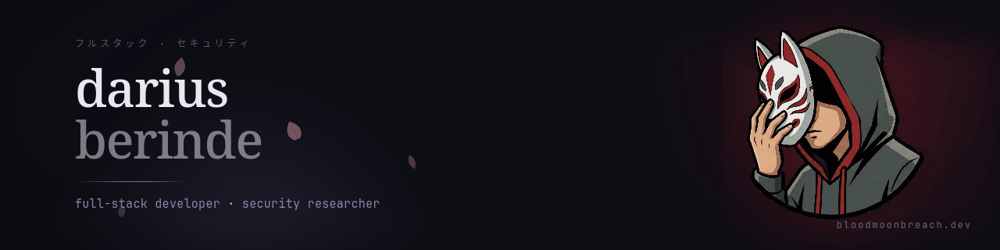

<div align="center">



<br/>

<!-- ブログ · プロジェクト — katakana echo of the site -->
`フルスタック`  ·  `セキュリティ`  ·  `bloodmoonbreach.dev`

</div>

---

###  &nbsp; アバウト &nbsp; about

```
two tracks, one keyboard.
builder by day · breaker after hours.

> full-stack developer transitioning into a cybersecurity track.
> i write web apps, then i try to break them.
> this is the public log.
```

<br/>

###  &nbsp; スタック &nbsp; stack

<p>
  
  
  
  
  
</p>
<p>
  
  
  
  
</p>

<br/>

###  &nbsp; スタッツ &nbsp; stats

<table border="0">
  <tr>
    <td valign="top" width="50%">
      
    </td>
    <td valign="top" width="50%">
      
    </td>
  </tr>
</table>


<br/>
<br/>

###  &nbsp; コンタクト &nbsp; contact

<p>
  <a href="https://bloodmoonbreach.dev">
    
  </a>
  <a href="https://www.linkedin.com/in/darius-berinde">
    
  </a>
  <a href="mailto:hello@bloodmoonbreach.dev">
    
  </a>
</p>

<div align="center">
  <br/>
  <sub><code>if an animation would distract someone reading a paragraph, it doesn't exist.</code></sub>
</div>
